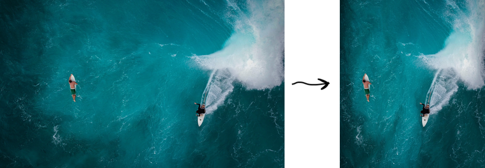
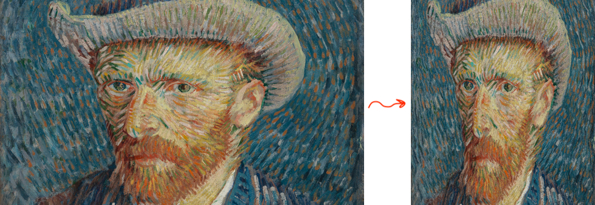

# JS IMAGE CARVER

Content-aware image resizer

- ▶️ [️Demo](https://trekhleb.dev/js-image-carver/)
- ✏️ [How it works](https://trekhleb.dev/blog/2021/content-aware-image-resizing-in-javascript/)
- 📄 [Seam carving paper](https://perso.crans.org/frenoy/matlab2012/seamcarving.pdf) by *Shai Avidan* and *Ariel Shamir*

Background image by [Ian Dooley](https://unsplash.com/@sadswim?utm_source=unsplash&utm_medium=referral&utm_content=creditCopyText)

### Content-aware image resizing

*Content-aware image resizing* might be applied when it comes to changing the image proportions (i.e. reducing the width while keeping the height) and when losing some parts of the image is not desirable. Doing the straightforward image scaling in this case would distort the objects in it. To preserve the proportions of the object while changing the image proportions we may use the [Seam Carving algorithm](https://perso.crans.org/frenoy/matlab2012/seamcarving.pdf).

In the example below, you may see how the original image width was reduced by 50% using content-aware resizing (left image) and straightforward scaling (right image). In this particular case, the left image looks more natural since the proportions of the balloons were preserved.

The Seam Carving algorithm’s idea is to find the *seam* (continuous sequence of pixels) with the lowest contribution to the image content and then *carve* (remove) it. This process repeats over and over again until we get the required image width or height. In the example below, you may see that the hot air balloon pixels contribute more to the content of the image than the sky pixels. Thus, the sky pixels are being removed first.

> Btw, finding the seam with the lowest energy is a pretty computationally expensive task (especially for large images). To make the seam search faster the dynamic programming approach [might be applied](https://trekhleb.dev/blog/2021/content-aware-image-resizing-in-javascript/).

### Objects removal

The importance of each pixel (so-called pixel's energy) is being calculated based on its color (`R`, `G`, `B`) difference between two neighbor pixels. More detailed explanation with examples you may find in [Content-aware image resizing in JavaScript](https://trekhleb.dev/blog/2021/content-aware-image-resizing-in-javascript/) blog post. Now, if we set the pixel energy to some really low level artificially (i.e. by drawing a mask on top of them), the Seam Carving algorithm would perform an **object removal** for us for free.

You may [launch the JS IMAGE CARVER](https://trekhleb.dev/js-image-carver/) and play around with resizing of your custom images. You may also check its [source-code](https://github.com/trekhleb/js-image-carver/tree/main/src/utils).

### More examples

Here are some more examples of how the algorithm copes with more complex backgrounds.

Mountains on the background are being shrunk smoothly without visible seams.

The same goes for the ocean waves. The algorithm preserved the wave structure without distorting the surfers.

But also we need to keep in mind that the Seam Carving algorithm is not a silver bullet, and it may fail to resize the images where most of the pixels are edges (looks important to the algorithm). In this case, it starts distorting even the important parts of the image. In the example below the content-aware image resizing looks pretty similar to a straightforward scaling since for the algorithm all the pixels look important, and it is hard for it to distinguish Van Gogh's face from the background.
  

  
## Features
  
- [x] Downscaling of the images without distorting their content-intensive parts
- [x] Objects removal during resizing
  
## Plans
  
- [ ] Image upscaling
- [ ] Upscale the image to its original size after objects removal
- [ ] Real-time resizing
  
## Author
  
- [@trekhleb](https://trekhleb.dev)
 Job details
Needed FullStack Developer with Bubble and React experience
Full Stack Development
Posted 10 minutes ago
Worldwide
We are looking for an experienced fullstack developer with good experience in both Bubble and React to help us on multiple tasks. For now we are trying to embed a Bubble form inside a React component. The successful candidate will be responsible for developing and maintaining our application, ensuring that it meets the highest standards of quality and functionality.

The ideal candidate should have strong experience working with both Bubble and React application development. You should have excellent problem-solving skills and be able to work independently as well as part of a team.

To apply for this position, please submit a proposal detailing your experience and how you can help with the project. Please include links to any relevant past completed projects that demonstrate your expertise in this area.

We are looking for someone who can start work immediately, and who is committed to delivering a high-quality product within the specified timeframe.
More than 30 hrs/week
Hourly
1 to 3 months
Project Length
Expert
I am willing to pay higher rates for the most experienced freelancers
$25.00

-

$50.00

Hourly

Contract-to-hire opportunity
This lets talent know that this job could become full time.
Learn more
Project Type:  Ongoing project
Skills and Expertise
React Bubble.io